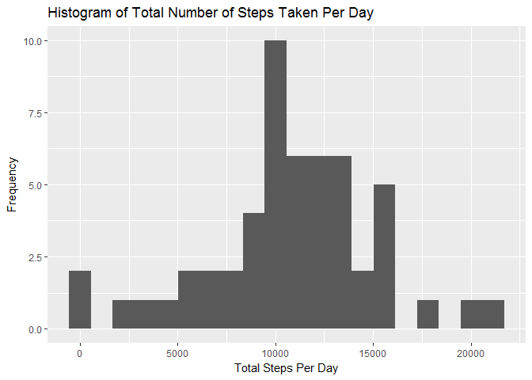
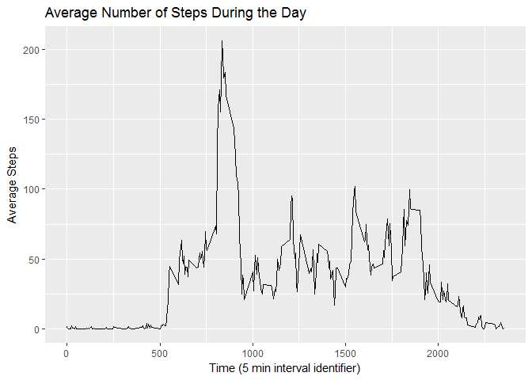
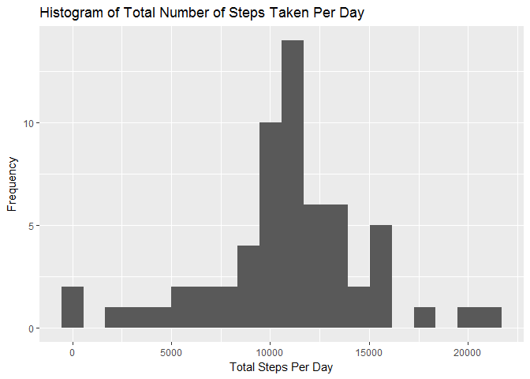
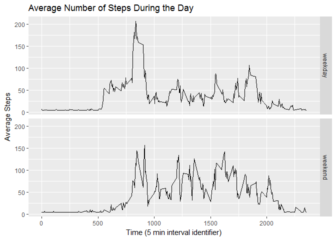

Reproducible Research: Peer Assessment 1
================
Thomas Miebach
January 4, 2018

A link to the original assignment can be found [here](https://www.coursera.org/learn/reproducible-research/peer/gYyPt/course-project-1). The paragraphs "Description" and "Data" below were copied into this document for reference.

Description
-----------

It is now possible to collect a large amount of data about personal movement using activity monitoring devices such as a [Fitbit](http://www.fitbit.com), [Nike Fuelband](http://www.nike.com/us/en_us/c/nikeplus-fuelband), or [Jawbone Up](https://jawbone.com/up). These type of devices are part of the "quantified self" movement -- a group of enthusiasts who take measurements about themselves regularly to improve their health, to find patterns in their behavior, or because they are tech geeks. But these data remain under-utilized both because the raw data are hard to obtain and there is a lack of statistical methods and software for processing and interpreting the data.

This assignment makes use of data from a personal activity monitoring device. This device collects data at 5 minute intervals through out the day. The data consists of two months of data from an anonymous individual collected during the months of October and November, 2012 and include the number of steps taken in 5 minute intervals each day.

Data
----

The data for this assignment can be downloaded from the course web site:

-   Dataset: [Activity monitoring data](https://d396qusza40orc.cloudfront.net/repdata%2Fdata%2Factivity.zip) \[52K\]

The variables included in this dataset are:

-   **steps**: Number of steps taking in a 5-minute interval (missing values are coded as `NA`)

-   **date**: The date on which the measurement was taken in YYYY-MM-DD format

-   **interval**: Identifier for the 5-minute interval in which measurement was taken

The dataset is stored in a comma-separated-value (CSV) file and there are a total of 17,568 observations in this dataset.

Loading and preprocessing the data
----------------------------------

``` r
# Unzip data file (if necessary) and read data
    if(!file.exists("activity.csv")){
        unzip("activity.zip")
    }
    mydata <- read.csv("activity.csv", header = TRUE, colClasses = c("integer", "Date", "integer"))

# Calculate and assign variables for in-line text computational output
    variable_names <- names(mydata)
    mydata_frame_dimensions <- dim(mydata)
    n_missing <- sum(is.na(mydata$steps))
    n_unique_days <- length(unique(mydata$date))
    n_unique_intervals <- length(unique(mydata$interval))
```

**17568** observations of **3** variables (**steps, date, interval**) were assigned ot the data frame **mydata**.
Variable **date** contains **61** unique days.
Variable **interval** contains **288** unique 5 minute intervals per day.
Variable **steps** contains **2304** missing ("NA") values.
For additional analysis regarding missing data see "Imputing Missing Values" section below.

What is mean total number of steps taken per day?
-------------------------------------------------

``` r
# Calulate total number of steps for each unique day. It is important not to 
# remove missing values as the sum for days with missing values calculates  
# incorrectly to "0" instead of "NA"
    steps_by_day <- mydata %>% group_by(date) %>% summarise(steps_sum = sum(steps, na.rm = FALSE))

# Plot Histogram of data; missing data will be excluded from graph
    ggplot(steps_by_day, aes(steps_sum)) + geom_histogram(bins = 20) + xlab("Total Steps Per Day") + ylab("Frequency") + ggtitle("Histogram of Total Number of Steps Taken Per Day")
```

    ## Warning: Removed 8 rows containing non-finite values (stat_bin).



``` r
# Calculate mean and median; need to exclude mssing data here.
    steps_mean <- mean(steps_by_day$steps_sum, na.rm = TRUE)
    steps_median <- median(steps_by_day$steps_sum, na.rm = TRUE)
```

Days with missing data were excluded from graph.
The mean number of steps is **10766**.
The median number of steps is **10765**.

What is the average daily activity pattern?
-------------------------------------------

``` r
# calulate the average number of steps for each unique time interval
    steps_average_by_interval <- mydata %>% group_by(interval) %>% summarise(steps_average = mean(steps, na.rm = TRUE))

# Plot Histogram of data
    g <- ggplot(steps_average_by_interval, aes(interval, steps_average))
    g + geom_line() + xlab("Time (5 min interval identifier)") + ylab("Average Steps") + ggtitle("Average Number of Steps During the Day")
```



``` r
# Determine interval of highest average step count
# Round average step count to nearest whole step
    steps_max <- round(steps_average_by_interval[which.max(steps_average_by_interval$steps_average),], digits = 0)
```

The maximum average step count of **206** occurs at time interval identifier **835**.

Imputing missing values
-----------------------

Variable **steps** contains **2304** missing ("NA") values.

``` r
data_missing <- mydata[is.na(mydata$steps),]
n_dates_missing <- length(unique(data_missing$date))
```

Analysis of the missing data shows that the missing values are represeneted by **8** unique dates.

``` r
# Confirm for each date that step data is present (originally done manually)
    n <- integer(1)
    for(i in 1:length(data_missing$date)){
        if(!is.na(data_missing$steps[i])){
            n = n + 1}
    }
```

**0** step data points were collected for these unique dates.

It was decided to replace the missing values with the overall mean of the daily steps.
This should have no impact on the calculated mean and minimal impact on the median.

``` r
# Copy mydata to mydata_filled
    mydata_filled <- mydata

# Replace "NA" with previously calculated mean value
    mydata_filled$steps[is.na(mydata$steps)] <- mean(mydata$steps, na.rm = TRUE)
```

``` r
# recalulate total number of steps for each unique day with filled data
    steps_by_day_filled <- mydata_filled %>% group_by(date) %>% summarise(steps_sum = sum(steps, na.rm = FALSE))

# Plot Histogram of data
    ggplot(steps_by_day_filled, aes(steps_sum)) + geom_histogram(bins = 20) + xlab("Total Steps Per Day") + ylab("Frequency") + ggtitle("Histogram of Total Number of Steps Taken Per Day")
```



``` r
# Calculate mean and median with filled data
# Round mean step count to nearest whole step
    steps_mean_filled <- mean(steps_by_day_filled$steps_sum, na.rm = TRUE)
    steps_median_filled <- median(steps_by_day_filled$steps_sum, na.rm = TRUE)
```

The mean number of steps is **10766**.
The median number of steps is **10766**.
As anticipated, the mean has not changed and the median was only slightly affected.

Are there differences in activity patterns between weekdays and weekends?
-------------------------------------------------------------------------

``` r
# Generate columns with weekday information
    mydata_filled$weekday <- weekdays(mydata_filled$date, abbreviate = TRUE)
# Replace Mon:Fri with "weekday" and Sat:Sun with "weekend"
    for(i in 1:length(mydata_filled$weekday)) {
        if(mydata_filled$weekday[i] == "Sat" | mydata_filled$weekday[i] == "Sun"){
            mydata_filled$weekday[i] <- "weekend"
        }
        else{
            mydata_filled$weekday[i] <- "weekday"
        }
    }
```

``` r
# calculate the average number of steps for each unique time interval
    steps_average_by_interval <- mydata_filled %>% group_by(interval, weekday) %>% summarise(steps_average = mean(steps, na.rm = TRUE))

# Plot Histogram of data
    g <- ggplot(steps_average_by_interval, aes(interval, steps_average))
    g + geom_line() + facet_grid(weekday ~ .) + xlab("Time (5 min interval identifier)") + ylab("Average Steps") + ggtitle("Average Number of Steps During the Day")
```


